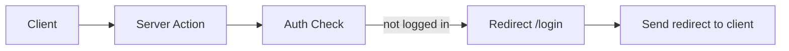
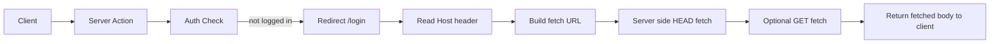
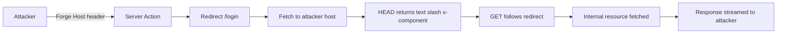

https://www.assetnote.io/resources/research/digging-for-ssrf-in-nextjs-apps

## Normal Flow



```ts
export async function action(req) {
  if (!userIsLoggedIn(req)) {
    return redirect("/login")
  }
}
```

* Redirect returned directly
* No server side fetch

## Vulnerable Flow



```ts
export async function createRedirect(req, redirectPath) {
  const host = req.headers["host"]
  const url = `https://${host}${redirectPath}`

  const head = await fetch(url, { method: "HEAD" })
  if (head.headers.get("content-type") === "text/x-component") {
    const res = await fetch(url)
    return res.body
  }

  return "{}"
}
```

* Host header trusted
* Redirect handled server side

## Attack Path



```ts
export async function action(req) {
  // attacker controls Host header
  return createRedirect(req, "/login")
}
```

* Entry point is Host header
* Server used as SSRF client

## Missing Security Check

* No validation or restriction of Host header before server side fetch

## Resulting System State Change

* Server issues outbound requests to attacker chosen hosts
* Internal or metadata services become readable via response body
