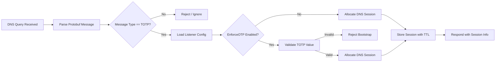
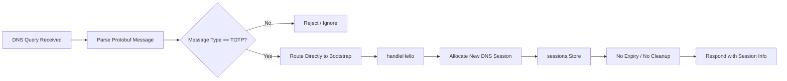
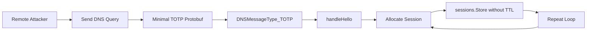

https://github.com/advisories/GHSA-wxrw-gvg8-fqjp

## 1. Normal (Intended) Flow — **OTP-Enforced Bootstrap**



**Key properties**

* OTP validation is a **hard gate** before session allocation.
* Sessions are created **only after authentication**.
* Sessions have **lifecycle control** (TTL / cleanup).

## 2. Vulnerable Flow — **OTP Flag Set but Not Enforced**



**Observed behavior**

* `EnforceOTP` is **read and stored**, but **never checked**.
* `TOTP` messages **always** result in session allocation.
* Sessions persist **indefinitely** in memory.

## 3. Attack Path — **Unauthenticated Memory Exhaustion**



**Attacker entry point**

* Enters at **`DNSMessageType_TOTP` bootstrap handling**
* No credentials, no valid OTP, no prior session required

## 4. Minimal Backend Pseudocode (Buggy Path)

```go
func handleHello(msg DNSMessage, cfg ListenerConfig) {
    // cfg.EnforceOTP is loaded but never enforced

    session := NewDNSSession(msg)
    sessions.Store(session.ID, session)

    sendBootstrapResponse(session)
}
```

Routing logic:

```go
if msg.Type == DNSMessageType_TOTP {
    handleHello(msg, cfg)
}
```

---

## 5. Missing Security Check (Explicit)

**Missing check:**

```go
if cfg.EnforceOTP && !ValidateTOTP(msg.OTP) {
    return error("invalid OTP")
}
```

**What should have happened**

* OTP validation must occur **before** session allocation.
* Failure must **terminate the bootstrap path**.
