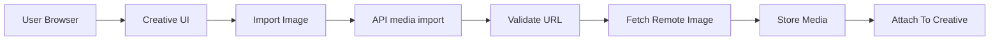
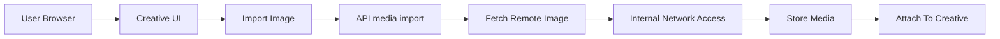
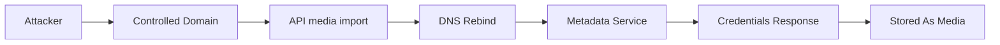

https://hackerone.com/reports/530974

## Normal Flow



* User supplies external image URL
* Backend validates destination
* Backend fetches image
* Image stored and bound to creative

## Vulnerable Flow



* URL accepted without validation
* Backend fetches arbitrary host
* Internal services reachable

## Attack Path



* Attacker controls initial DNS resolution
* DNS changed to link local metadata IP
* Backend reuses resolved IP
* Sensitive metadata returned

## Vulnerable Backend Logic

```go
func importMedia(url string) error {
    resp, err := http.Get(url)
    if err != nil {
        return err
    }
    data, _ := io.ReadAll(resp.Body)
    storeMedia(data)
    return nil
}
```

* Missing security check

  * No allowlist or denylist for IP ranges
  * No revalidation after DNS resolution
  * No block on link local or metadata IPs

* Resulting system state change

  * Backend performs authenticated requests to internal metadata service
  * SSH keys and instance metadata exposed to attacker
