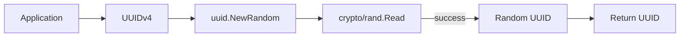
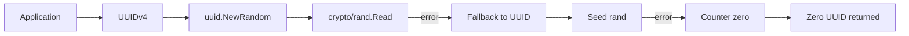
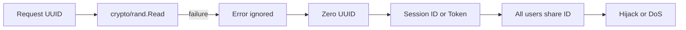

https://github.com/gofiber/utils/security/advisories/GHSA-m98w-cqp3-qcqr

## 1. Normal (Expected) Flow

```mermaid
flowchart LR
    A[Application] --> B[UUIDv4]
    B --> C[uuid.NewRandom]
    C --> D[crypto/rand.Read]
    D -->|success| E[Random UUID]
    E --> F[Return UUID]
```

## 2. Vulnerable Real Flow

```mermaid
flowchart LR
    A[Application] --> B[UUIDv4]
    B --> C[uuid.NewRandom]
    C --> D[crypto/rand.Read]
    D -->|error| E[Fallback to UUID]
    E --> F[Seed rand]
    F -->|error| G[Counter zero]
    G --> H[Zero UUID returned]
```

## 3. Attack Path — **Explicit Attacker Entry Point**

```mermaid
flowchart LR
    A[Request UUID] --> B[crypto/rand.Read]
    B -->|failure| C[Error ignored]
    C --> D[Zero UUID]
    D --> E[Session ID or Token]
    E --> F[All users share ID]
    F --> G[Hijack or DoS]
```
